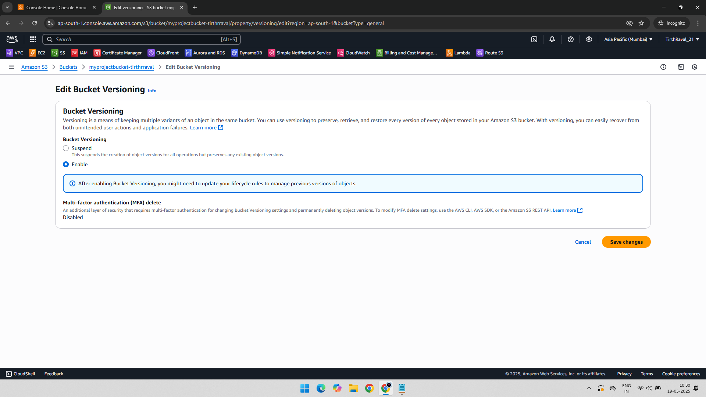
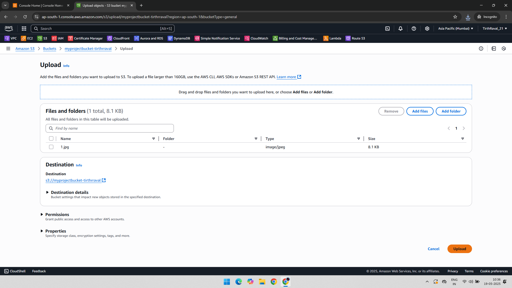
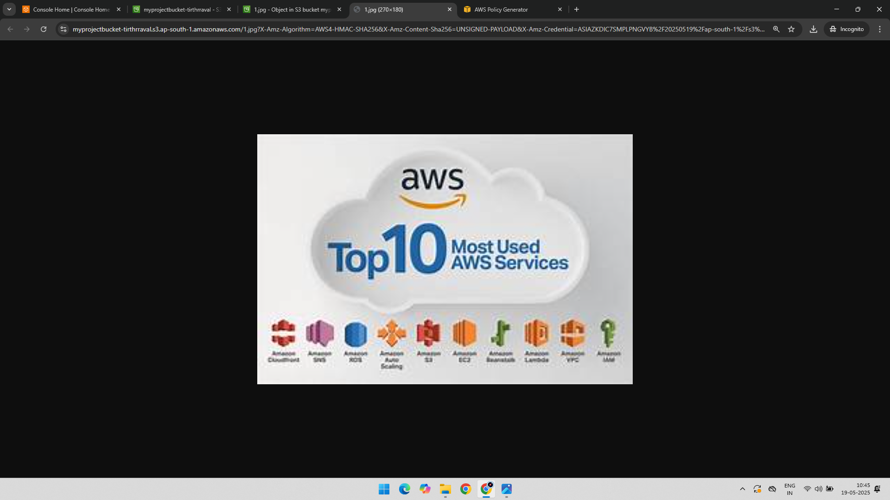
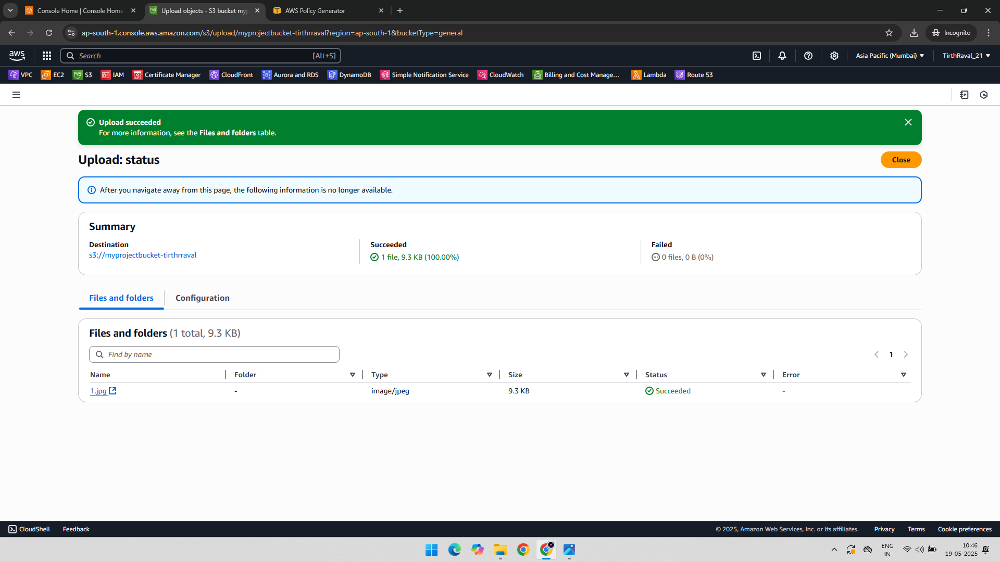
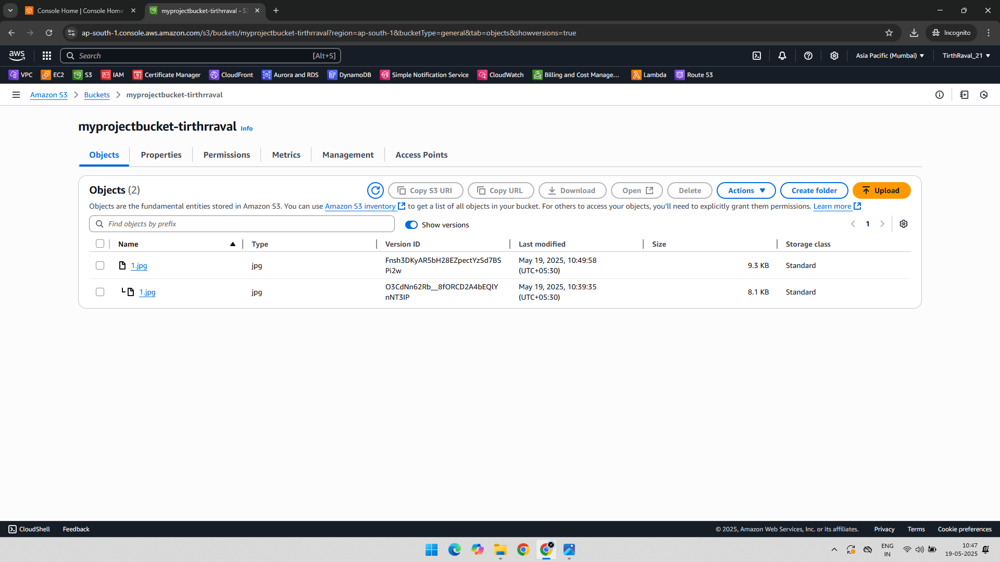

# Project: Amazon S3 – Bucket Versioning

## 📘 Overview

This project demonstrates how to enable **versioning** in an Amazon S3 bucket, upload multiple versions of an object, and manage different object versions using the AWS Management Console.

---

## 🧰 AWS Services Used

- Amazon S3
- AWS Management Console

---

## 🧑‍💻 Project Steps with Screenshots

### ✅ 1. Enable Bucket Versioning  
Versioning was enabled for the target S3 bucket to preserve, retrieve, and restore every version of every object.  

---

### 🖼️ 2. Upload Initial Image  
An image file was uploaded to the version-enabled bucket.  

---

### 📌 3. View Version One of the Object  
The object appeared with its initial version ID in the bucket.  

---

### 🔁 4. Upload Another Image with the Same Name  
A new file with the same object name was uploaded to create a second version.  

---

### 🧾 5. Verify Multiple Versions for Same Object  
Using the **"Show versions"** option in the console, the object now has multiple versions under the same name.  

---

### 📋 6. View All Object Versions  
Opening Both the Versions in the Browser to confirm. 

---

## ✅ Key Benefits

- **Data Protection**: Recover from unintended user actions like overwrites or deletions.
- **Auditability**: Maintain history of object changes.
- **Resilience**: Safeguard against data loss in applications.

---

## 📁 Folder Structure

S3-Bucket-Versioning/  
├── README.md  
├── 01-Enable-Bucket-Versioning.png  
├── 02-Add-image.png  
├── 03-Image-Version-One.png  
├── 04-Add-Another-Image-Same-Name.png  
├── 05-Different-Versions-Same-Name.png  
└── 06-Different-Versions.png  
