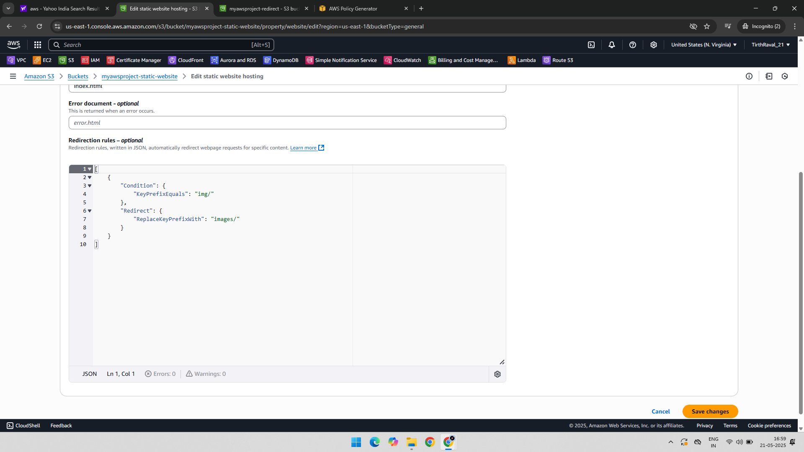
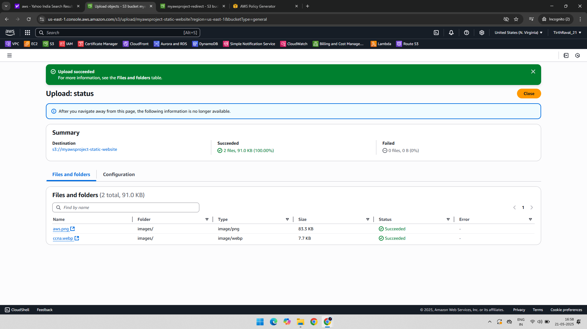
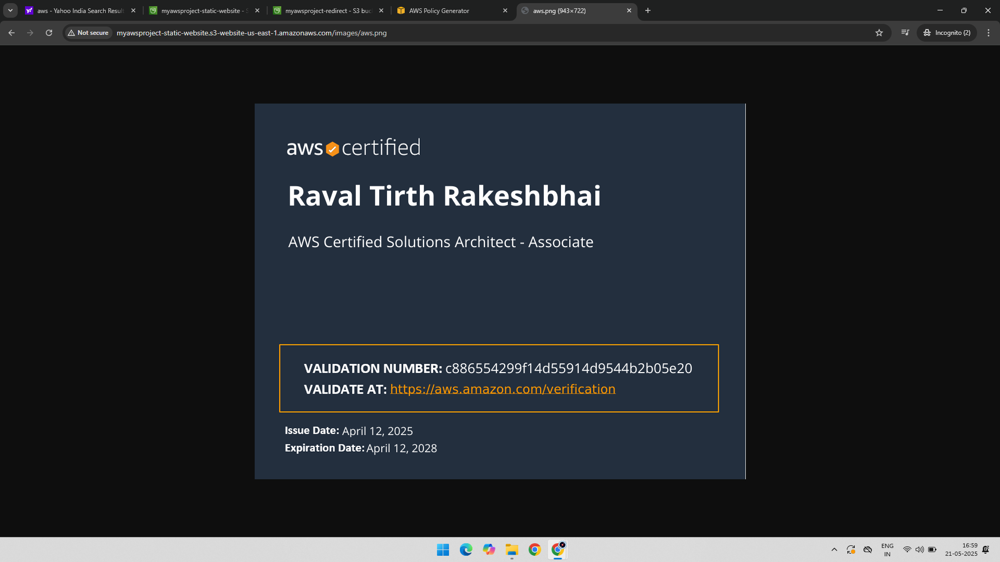

# Project: S3 Object Redirection using Prefix Rules

## 📘 Overview

This project demonstrates how to:
- Create a redirection rule using **prefix matching** in Amazon S3
- Upload objects with and without prefixes
- Access objects through static website hosting
- Observe how S3 handles redirection using prefix-based rules

Screenshots are included to help visualize each configuration and verification step.

---

## 🧰 AWS Services Used

- Amazon S3

---

## 🧑‍💻 Project Steps with Screenshots

### 📜 1. Configure Prefix-Based Redirection Rule  
A redirection rule is set up to redirect requests from a specific prefix to another target.  

### 📁 2. Upload Objects into the S3 Bucket  
Objects are added with and without the defined prefix to test redirection behavior.  

### 📂 3. Add Objects with Specific Prefix  
Files are uploaded using a prefix like `docs/`, simulating directory-like structure.  

### 🌐 4. Access the Prefixed Object in Browser  
Objects stored under a prefix are accessed via S3 static website endpoint, and redirection is confirmed.  

---

## ✅ Final Outcome

- Successfully demonstrated how S3 handles object access and redirection using prefixes
- Useful for structuring S3 content logically and managing request routing effectively
- Showcases how S3 static websites can simulate folder-based behavior using prefixes

---

## 📁 Folder Structure

S3-Objects-Prefix-Rules/  
├── README.md  
├── 01-Redirection-Rule.png  
├── 02-Object-Add.png  
├── 03-Prefix-Add.png  
└── 04-Prefix-Object-Open.png  
