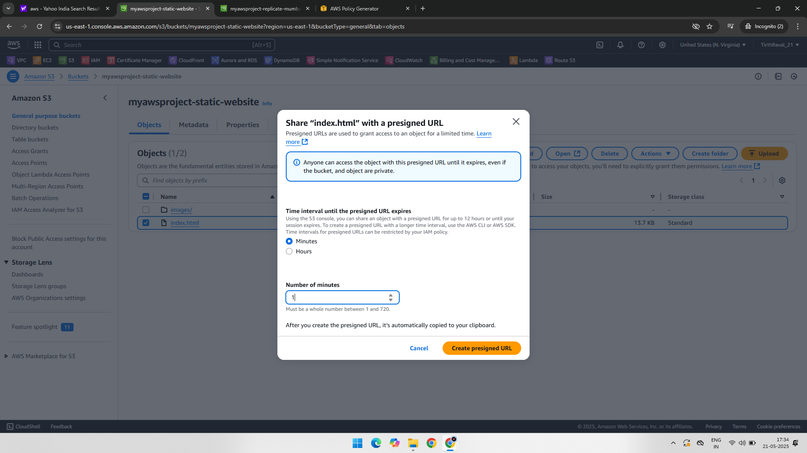
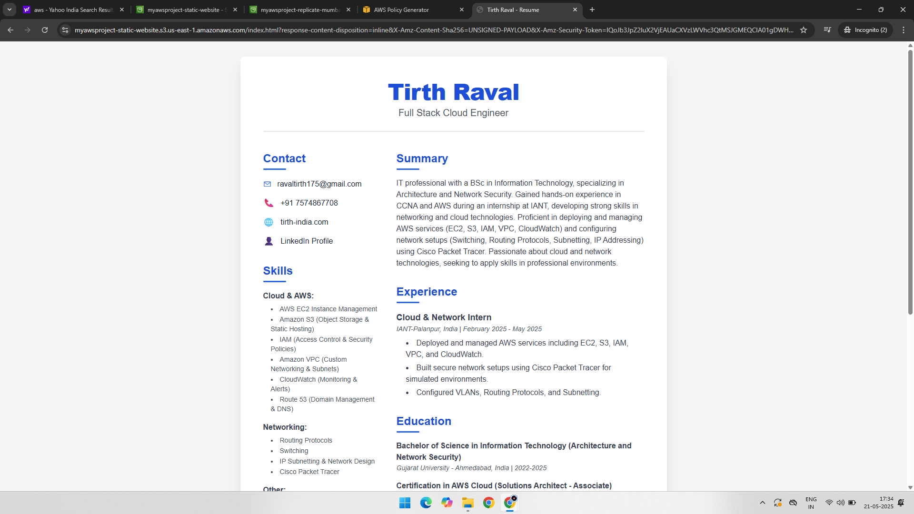

# Project: Amazon S3 – Presigned URL Access

## 📘 Overview

This project demonstrates how to generate and use **Presigned URLs** in Amazon S3. Presigned URLs allow secure, time-limited access to private S3 objects without making the bucket public.

---

## 🧰 AWS Services Used

- Amazon S3
- AWS Management Console

---

## 🧑‍💻 Project Steps with Screenshots

### 🔧 1. Configure Object Permissions for Presigned URL  
Uploaded an object and generated a **presigned URL** via the S3 console or programmatically (using AWS CLI/SDK).  

---

### 🔗 2. Generate Presigned URL  
A temporary URL was created that allows access to the object for a specific time period.  

---

### 🌐 3. Open Presigned URL in Browser  
Accessed the private object using the presigned URL in a web browser. The file downloaded or opened without requiring S3 bucket permissions.  

---

## ✅ Key Benefits

- **Security**: Objects remain private, but temporary access is possible.
- **Control**: You define the URL expiration time and permissions.
- **No public access**: Presigned URLs avoid the need for public buckets or objects.

---

## 📁 Folder Structure

S3-Predesigned-URL/  
├── README.md  
├── 01-Predesigned-URL-Configure.png  
├── 02-Presigned-URL.png  
└── 03-Object-Open-Predesigned-URL.png  
