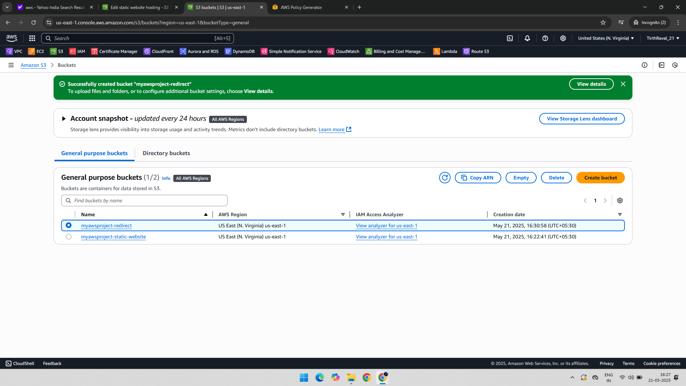
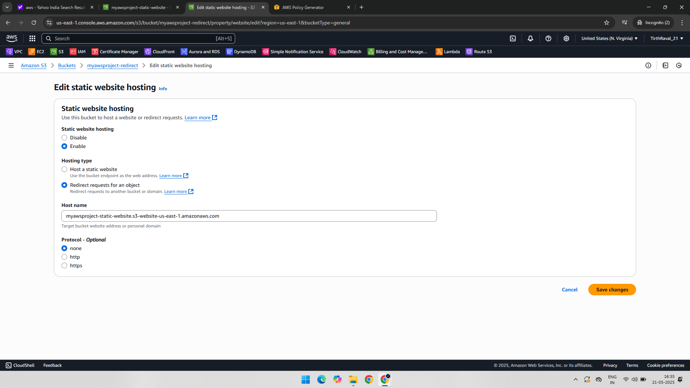
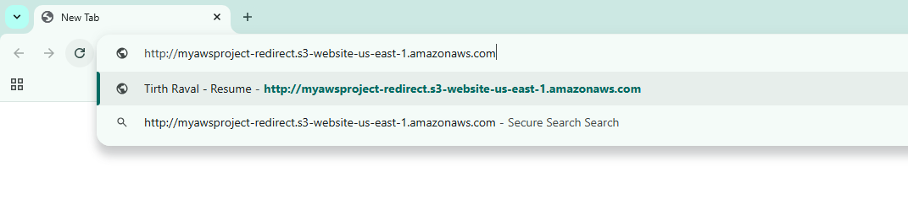
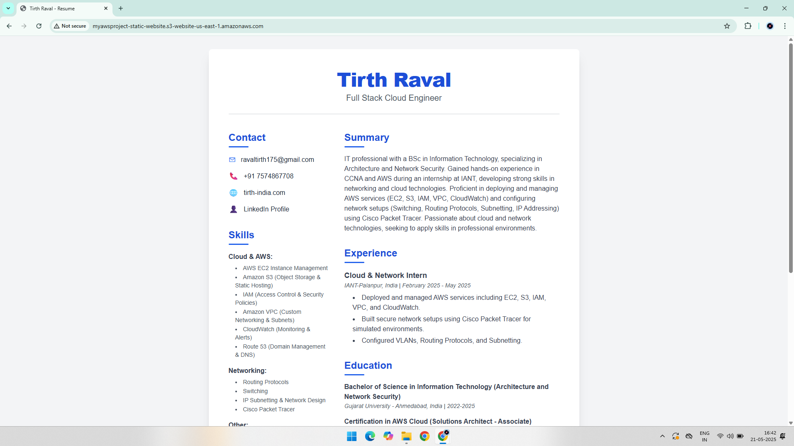

# Project: Website Redirection using Amazon S3

## 📘 Overview

This project demonstrates how to:
- Create an Amazon S3 bucket configured for website redirection
- Set up redirect rules (e.g., from one domain or path to another)
- Access the redirection through a browser
- Host a redirection-based static website

Each step is supported with screenshots to provide a complete visual guide.

---

## 🧰 AWS Services Used

- Amazon S3

---

## 🧑‍💻 Project Steps with Screenshots

### 🪣 1. Create S3 Bucket for Redirection  

### 🔁 2. Configure Static Website Redirection  

### 🌐 3. Test Redirection via Browser  

### 🧭 4. Confirm Static Website Redirection Behavior  

---

## ✅ Final Outcome

- Successfully created an S3 bucket configured for redirection
- Redirects user requests to the specified destination URL
- Useful for migrating domains, redirecting old pages, or simple site forwarding

---

## 📁 Folder Structure

S3-Redirect-Website-Project/  
├── README.md  
├── 01-Redirect-Bucket.png  
├── 02-Configure-Redirect.png  
├── 03-Redirect-link-browser.png  
└── 04-Redirect-Static-Website.png  
