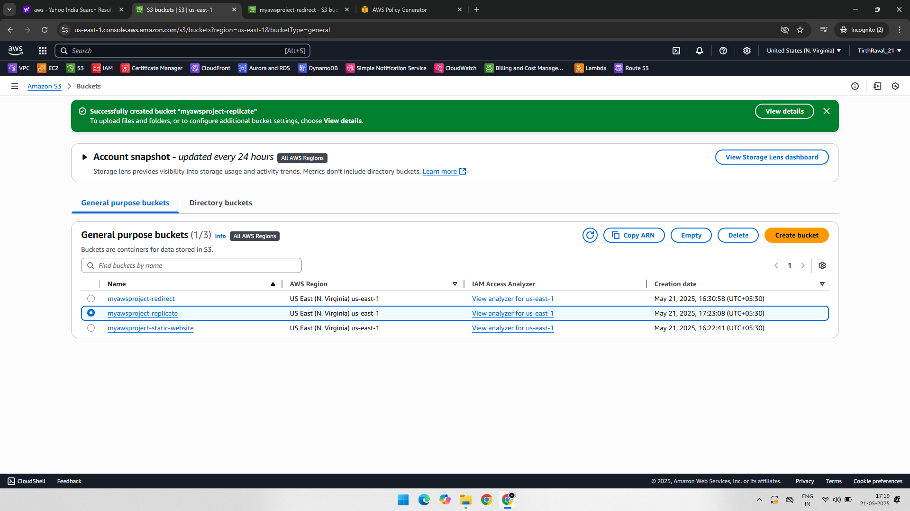
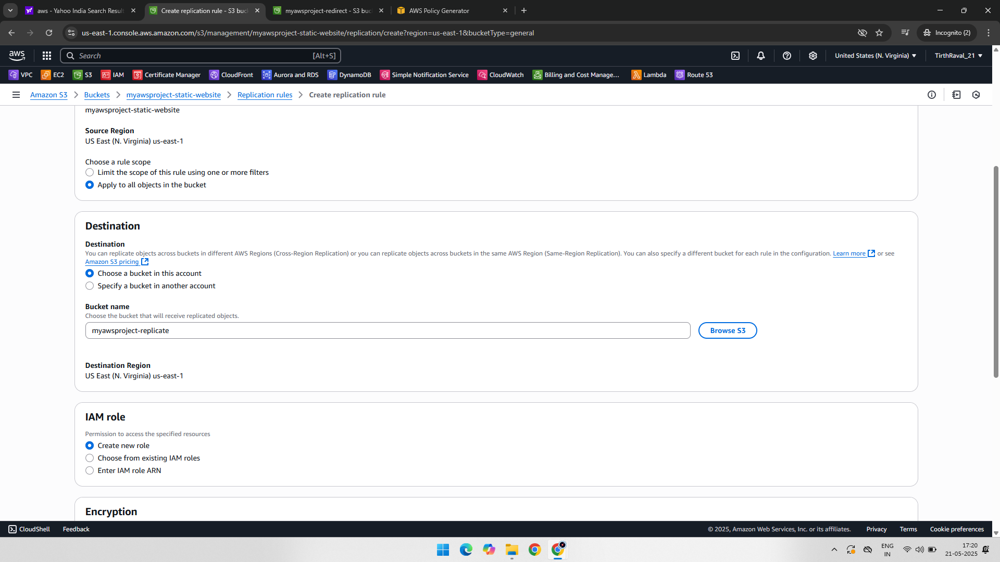
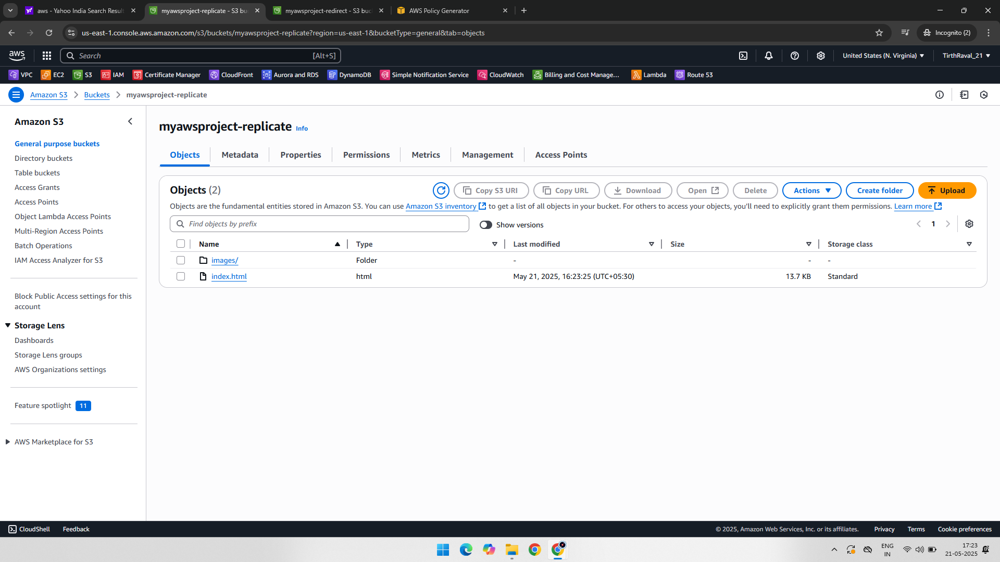
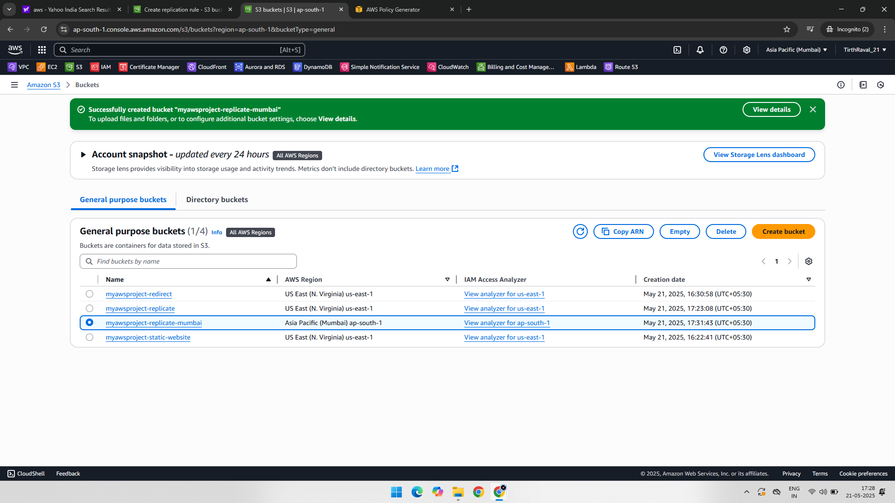
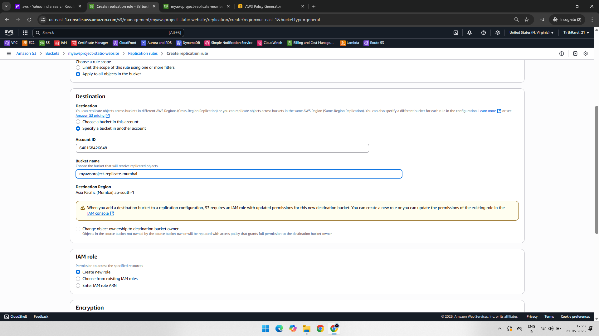
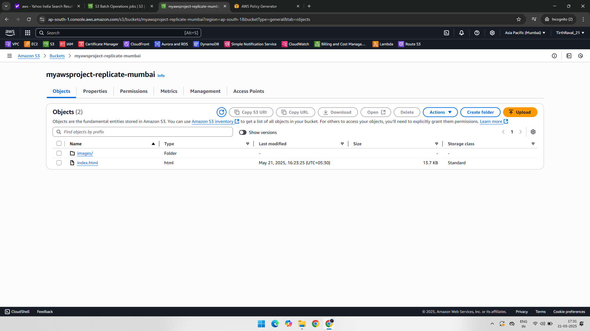

# Project: Amazon S3 – Same-Region and Cross-Region Replication

## 📘 Overview

This project demonstrates how to configure **Amazon S3 Replication** in:
- **Same Region**: Replicating objects between two buckets in the same AWS region.
- **Cross Region**: Replicating objects between buckets in different AWS regions.

The setup includes enabling versioning, defining replication rules, and verifying replicated objects in destination buckets.

---

## 🧰 AWS Services Used

- Amazon S3

---

## 🧑‍💻 Project Steps with Screenshots

### 🪣 1. Create Buckets and Enable Versioning  
Created source and destination buckets with versioning enabled.  

---

### 🔁 2. Configure Replication Rule (Same Region)  
Defined a replication rule for same-region replication.  

---

### 📂 3. Upload Object and Verify Replication (Same Region)  
Uploaded an object to the source bucket and verified its presence in the destination bucket (same region).  

---

### 🌍 4. Create Cross-Region Buckets  
Created source and destination buckets located in different regions.  

---

### 🌐 5. Configure Cross-Region Replication Rule  
Set up the replication configuration for cross-region replication.  

---

### ✅ 6. Upload Object and Confirm Replication (Cross Region)  
Uploaded an object and confirmed that it replicated successfully to the bucket in another region.  

---

## ✅ Final Outcome

- **Same-region replication** is helpful for backup and log aggregation.
- **Cross-region replication** ensures high availability and disaster recovery by storing copies in a geographically different region.
- Both configurations rely on versioning and replication rules.
- IAM roles were **automatically managed by S3** during setup (no manual IAM policy configuration done).

---

## 📁 Folder Structure

S3-Same|Cross-Region-Replication/  
├── README.md  
├── 01-Replicate-Bucket-Same-Region.png  
├── 02-Replication-Rule-Same-Region.png  
├── 03-Object-Replicated-Same-Region.png  
├── 04-Replicate-Bucket-Cross-Region.png  
├── 05-Replication-Rule-Cross-Region.png  
└── 06-Object-Replicated-Cross-Region.png  
