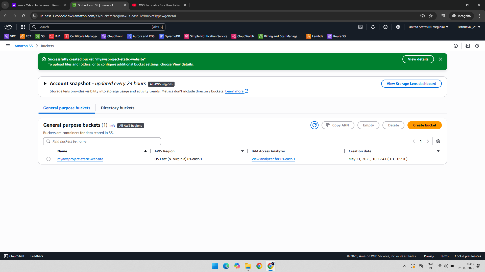
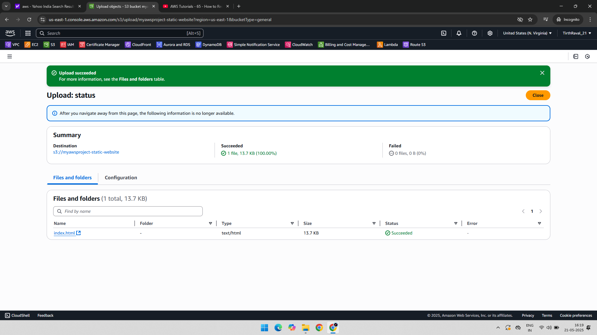
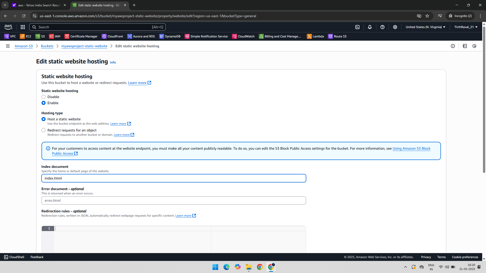
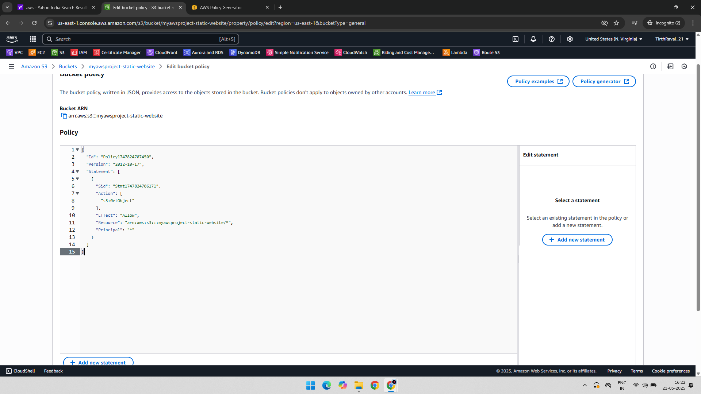
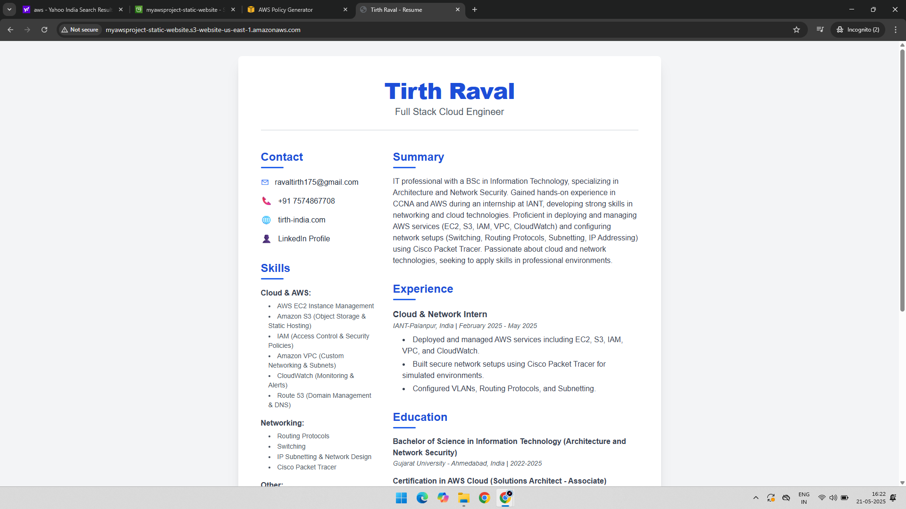

# Project: Static Website Hosting using Amazon S3

## 📘 Overview

This project demonstrates how to:
- Create an Amazon S3 bucket
- Upload static website files (`index.html`, `error.html`)
- Enable static website hosting on S3
- Apply a bucket policy to allow public access
- Access the static website via the S3 endpoint

All steps are explained visually with relevant screenshots.

---

## 🧰 AWS Services Used

- Amazon S3
- IAM (for applying bucket policies)

---

## 🧑‍💻 Project Steps with Screenshots

### 🪣 1. Create S3 Bucket  

### 📂 2. Upload Website Files (index.html, error.html)  

### 🌐 3. Enable Static Website Hosting  

### 🔓 4. Apply Bucket Policy for Public Access  

### 🌍 5. Access Website via Browser  

---

## ✅ Final Outcome

- A fully functional static website is hosted on Amazon S3
- Public access to the website is enabled using a bucket policy
- Accessible via the S3-generated static website endpoint

---

## 📁 Folder Structure

S3-Static-Website-Project/  
├── README.md  
├── 01-Static-Website-Bucket.png  
├── 02-Object-Website-Bucket.png  
├── 03-Enable-Static-Website.png  
├── 04-Bucket-Policy.png  
└── 05-Static-Website-Browser.png  
